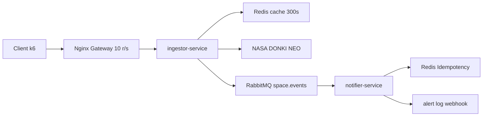

# Solar Shield -> Microsserviços de Clima Espacial

## Integrantes

- Nome 1 -> responsável: ingestor + Nginx

- Nome 2 -> responsável: notifier + idempotencia

- Nome 3 -> responsável: testes + k6 + docker-compose

## Visão geral

O Solar Shield é um sistema de microsserviços projetado para monitorar eventos de clima espacial utilizando dados da NASA. Ele classifica a severidade de tempestades geomagnéticas e gerencia notificações de emergência para infraestruturas críticas.

## Arquitetura



## Regras de negocio

- RN1: classificação por Kp (tabela)

- RN3: idempotencia por event_id (consumidor)

### Componentes

- `src/ingestor-service`: coleta os eventos NASA, aplica cache Redis e publica mensagens no RabbitMQ.
- `src/notifier-service`: consome a fila de alertas, garante idempotência e processa notificações de emergência.
- `docker-compose.yml`: orquestra Redis, RabbitMQ, ingestor, notifier e Nginx.

## Justificativa do TTL do cache

O cache no endpoint `/api/space-weather/current` possui um TTL de **300 segundos (5 minutos)**.

Justificativa:

- Os dados de clima espacial da NASA não mudam em intervalos de milissegundos.
- 5 minutos reduz a carga na API externa.
- O valor mantém o sistema responsivo sem perder atualizações críticas de tempestades em andamento.

## Como rodar

### Com Docker Compose

```bash
docker compose up --build
```

### Manualmente

Para rodar cada serviço isoladamente:

```bash
cd src/ingestor-service
npm install
npm start
```

```bash
cd src/notifier-service
npm install
npm start
```

Também é necessário ter Redis e RabbitMQ em execução localmente ou via Docker.

## Endpoints

- `GET /api/space-weather/current`: retorna o clima espacial atual (com cache).
- `POST /api/space-weather/ingest`: dispara a ingestão de dados históricos da NASA e publica alertas no RabbitMQ.
- `GET /api/neo/feed?date=YYYY-MM-DD`: consulta objetos próximos à Terra (endpoint experimental).
- `GET /health`: retorna status do serviço `ingestor`.
### Payload do endpoint de ingestão

```json
{
  "startDate": "2026-01-01",
  "endDate": "2026-01-02"
}
```

## Testes
Para rodar os testes unitários:

```bash
npm install
npm test
```

Para rodar o smoke test k6:

```bash
k6 run k6/smoke.js
```

### Principais testes

- `tests/cache.test.js`: valida cache HIT/MISS, TTL e headers `X-Cache`.
- `tests/retry-backoff.test.js`: valida retry exponencial em chamadas à NASA e comportamento para erros 429/5xx/timeout.
- `tests/rn1.classify.test.js`: valida classificação do índice Kp e extração dos valores de Kp.
- `tests/rn3.idempotency.test.js`: valida idempotência Redis + RabbitMQ e tratamento de duplicados.

## Estrutura de pastas

```text
solar-shield/
  README.md
  docker-compose.yml
  nginx.conf
  .env.example          # opcional, exemplo de variáveis de ambiente
  /src
    /ingestor-service   # consome NASA, classifica, publica no RabbitMQ
      Dockerfile
      package.json
      index.js
      cache.js
      classify.js
      nasa_client.js
    /notifier-service   # consome fila, aplica idempotência, dispara alerta
      Dockerfile
      package.json
      index.js
      notifier.js
      idempotency.js
      logging.js
  /tests
    cache.test.js       # teste do cache e TTL
    retry-backoff.test.js
    rn1.classify.test.js
    rn3.idempotency.test.js
  /k6
    smoke.js            # teste de carga/smoke para o endpoint principal
  /docs
    arquitetura.png     # opcional, exportado do Mermaid
```

